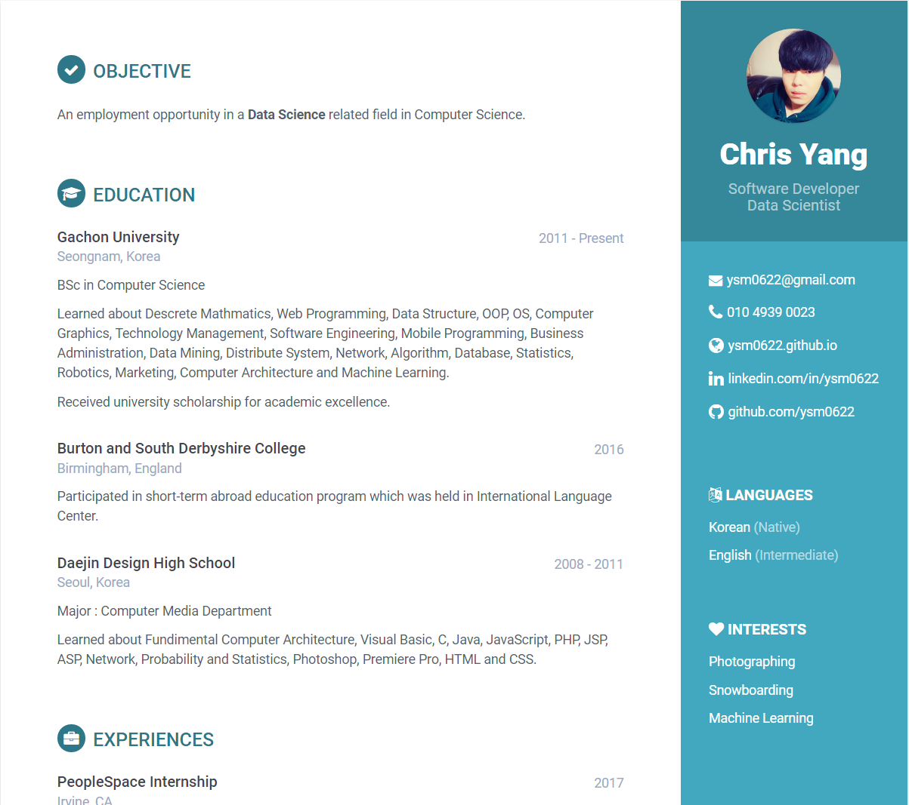

Resume
======
This is my CV. 
You will most likely find it under [HERE](https://goo.gl/6D5Qbs).

## Screenshot

  

## Technology
* CSS frameworks, e.g. BootStrap
* Themes  
* JS frameworks, e.g. jQuery
* IconSets, e.g. [Glyphicons](http://glyphicons.com/)
* [GitHub Pages](http://pages.github.com/)

## Contact
#### Developer
* Homepage: [Link](https://goo.gl/6D5Qbs)
* E-mail: ysm0622@gmail.com

## License
* This project is licensed under the MIT License - see the [LICENSE.md](LICENSE.md) file for details. 
